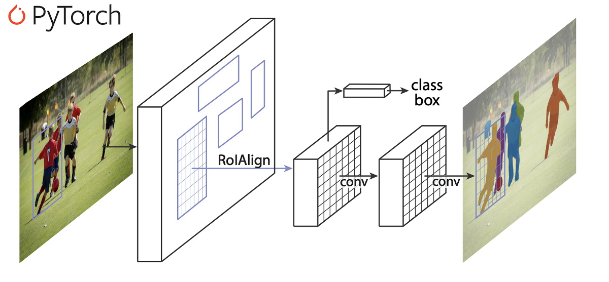
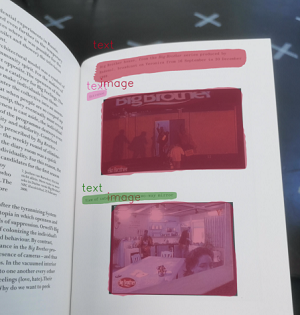
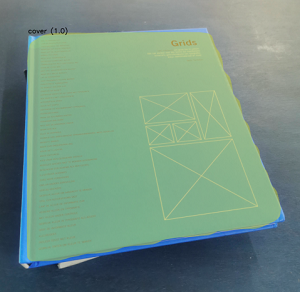

# Mask-RCNN-pytorch
Pytorch implementation of [Mask-RCNN](https://arxiv.org/abs/1703.06870) based on torchvision model with VOC dataset format. The model generates segmentation masks and their scores for each instance of an object in the image. This repository is based on [TorchVision Object Detection Finetuning Tutorial](https://pytorch.org/tutorials/intermediate/torchvision_tutorial.html).



## Training

label your data with [labelme](https://github.com/wkentaro/labelme) and Export VOC-format dataset from json files with [labelme2voc](https://github.com/wkentaro/labelme/tree/master/examples/instance_segmentation).

Prepare your dataset in this format:
```
my_dataset
      ├── labels.txt
      │
      ├── JPEGImages
      │       ├── image1.jpg
      │       └── image2.jpg
      │
      ├── SegmentationObject
      │       ├── image1.png
      │       └── image2.png
      │
      └── SegmentationClass
              ├── image1.png
              └── image2.png
```
Clone the repository and put ```my_dataset``` folder in ```Mask-RCNN-pytorch``` folder then use this line of code to train:
```
$ python3 train.py --data my_dataset --num_classes 11 --num_epochs 150
```
Enter ```num_classes``` including background.

## Testing
Enter your class names using ```classes``` variable in ```mask_rcnn.py``` then use this line of code to test on your image:
```
$ python3 test.py --img test_img.jpg --model ./maskrcnn_saved_models/mask_rcnn_model.pt
```
Here are some output results:

 

